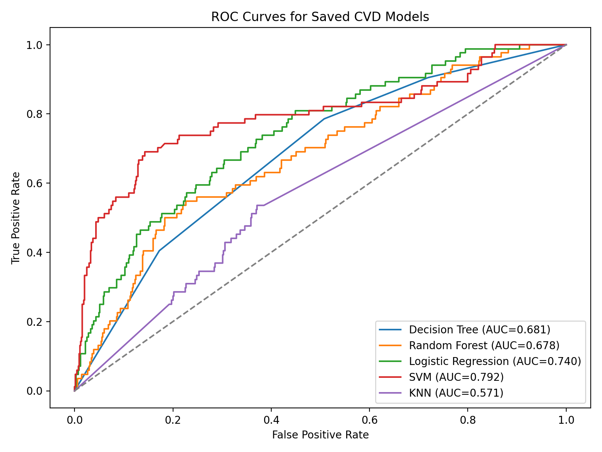
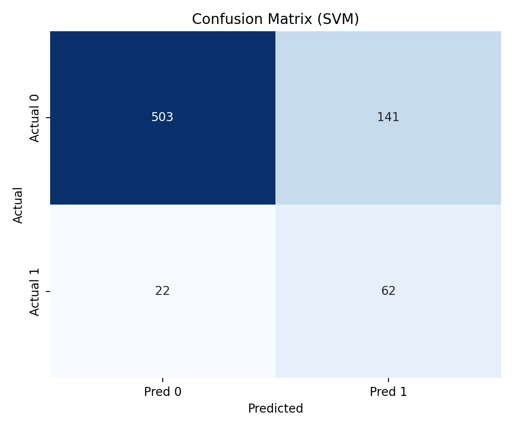
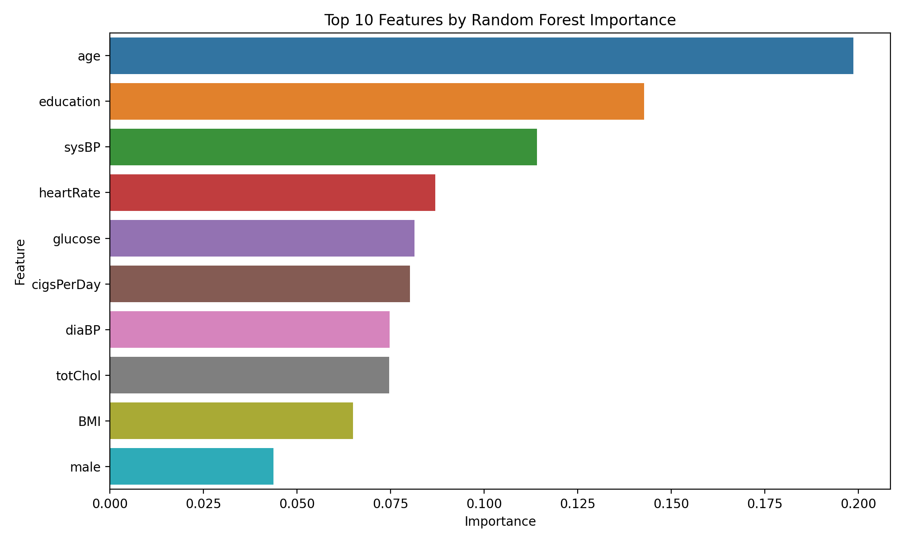

# CVD-AI: Cardiovascular Disease Risk Prediction System

CVD-AI is an end-to-end project for 10-year cardiovascular disease risk prediction using the Framingham dataset. It combines a Python ML pipeline, a FastAPI model service, an Express backend, and a React frontend.

## Key Results

The following results are from the currently saved models in `cvd-ai-python/Trained_Models` evaluated on the existing processed split (`test_size=0.2`, `random_state=4`):

| Model | Accuracy | Precision | Recall | F1 | ROC-AUC |
| --- | ---: | ---: | ---: | ---: | ---: |
| Decision Tree | 0.8846 | 0.0000 | 0.0000 | 0.0000 | 0.6807 |
| Random Forest | 0.8063 | 0.2645 | 0.3810 | 0.3122 | 0.6781 |
| Logistic Regression | 0.6909 | 0.2191 | 0.6548 | 0.3284 | 0.7400 |
| **SVM** | 0.7761 | 0.3054 | 0.7381 | 0.4321 | **0.7919** |
| KNN | 0.7033 | 0.1413 | 0.3095 | 0.1940 | 0.5707 |

> Current best model by ROC-AUC: **SVM (0.7919)**.

## Project Components

- **ML Core (`cvd-ai-python/`)**: preprocessing, training scripts, model artifacts, evaluation utilities, FastAPI model server.
- **Backend (`cvd-backend/`)**: Express + TypeScript API for application services and integration.
- **Frontend (`cvd-frontend/`)**: React + Vite interface for prediction and user workflows.
- **Docs (`docs/`)**: architecture diagrams and supporting project materials.

## Repository Structure

```text
cvd-ai/
├── README.md
├── LICENSE
├── requirements.txt
├── docs/
│   └── diagrams/
├── cvd-ai-python/
│   ├── src/
│   ├── Model_Training/
│   ├── processing/
│   ├── Trained_Models/
│   ├── VisualizedImages/
│   └── server/
├── cvd-backend/
└── cvd-frontend/
```

## Quick Start

### 1) ML service (FastAPI)

```bash
cd cvd-ai-python
python3 -m pip install -r requirements.txt
python3 run_server.py
```

Service runs on `http://localhost:8001`.

### 2) Backend (Express/TypeScript)

```bash
cd cvd-backend
npm install
npm run dev
```

### 3) Frontend (React/Vite)

```bash
cd cvd-frontend
npm install
npm run dev
```

## ML Pipeline Entry Points

- `cvd-ai-python/src/data_preprocess.py`: clean raw data and create processed datasets.
- `cvd-ai-python/src/train.py`: train and persist model artifacts.
- `cvd-ai-python/src/evaluate.py`: evaluate saved models and generate plots/metrics.
- `cvd-ai-python/src/inference.py`: local model inference utility.

Example:

```bash
cd cvd-ai-python
python3 src/evaluate.py
```

## Visual Outputs

Evaluation artifacts are generated in `cvd-ai-python/VisualizedImages/`:

- `roc_curve.png`
- `confusion_matrix_best_model.png`
- `feature_importance_random_forest.png`
- `model_metrics.csv`





## Architecture Diagrams

- Class diagram: `docs/diagrams/ClassDiagram.drawio`
- Sequence diagram: `docs/diagrams/sequenceDiagram.drawio`

## Makefile Shortcuts

```bash
make preprocess
make train
make evaluate
make ml-api
```
